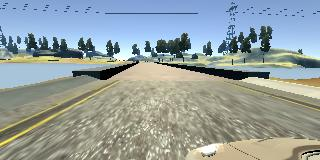
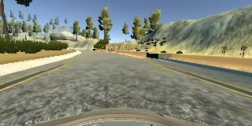
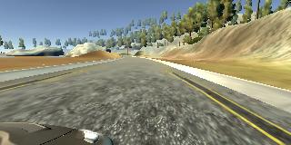

# Behavioral Cloning project (Term 1)

## Objective
The goal of this project is to train a feed-forward neural network that is able to steer a car in a racing simulator.

## Approach
In order to build a training set, the racing simulator provides a training mode. When running in training mode, images of the left-, center-, and right-view of the car are saved, together with the corresponding steering annotation (as well as a number of other ones, which we did not use); the data is available in the generated `driving_log.csv` file. The simulator also has an autonomous mode, in which it broadcasts the current car view, and accepts steering commands emitted by the `drive.py` script (provided), which it then executes.

## Data collection
Udacity provided a training set that should suffice for getting a working steering model for track 1. However, a quick look at the corresponding `driving_log.csv` file shows that the steering signal is pretty sparse (that is, it is `0.0` in most rows). In theory, this is not a problem, since using mean-squared error as a loss function should make the learned value converge to the average of all the labels at each input. However, in a small dataset, this could definitely be an obstacle.
Moreover, the amount of data provided is pretty small. Therefore, I chose to collect more training data, using my mouse to drive the car (and avoid the sparseness problem mentioned above). From a utilitarian perspective, it was definitely a better use of my time to record a good training set as opposed to stick do a smaller training set and to iterate more times on other fronts (e.g. network architecture). Almost `3GB` worth of data were collected; my dataset is available [here](https://drive.google.com/open?id=0BzHXlT0zHqM9Rm5mdk45Sm9WWms). I shared it on the Slack
channel `#p-behavioral-cloning` (I give permission for Udacity to share it at will, but I would suggest correcting the directories in `driving_log.csv`; somehow the simulator records absolute directories, not relative ones, which is rather silly). The data collected includes many laps, both clockwise and counter-clockwise, all of which corresponding to track 1. In most laps, I tried to make the car stay as close to the center as possible, but I did include a few examples of "saves"; this was
probably not necessary, since naturally I don't stay perfectly centered in the track, and there is always some amount of error-correction going on in all laps.
A few examples of collected images may be found below.

## Training pipeline
The model `model.h5` was trained for `3` epochs. At each epoch, we shuffle the rows of our in-memory copy of `driving_log.csv`, and iterate through them in batches. A generator is used to ensure that the number of images that are loaded in-memory is equal to the batch size. Images are loaded with `cv2.imread` and converted from BGR to RGB with `cv2.cvtColor`; it should probably be made clear on the project statement which format the network should accept as input. It took me a while to figure out that I was feeding the channels in the wrong order (BGR in training, RGB when testing on the
simulator); after reading through the Slack channel, other people had exactly the same issue, and their car was crashing precisely in the same location (after crossing the bridge, it fails to complete a left-turn). Images from the left- and right-view of the car were also used in the training set; we used a correction of `0.025` in the steering angle. Images were also always horizontally flipped (negating the corresponding steering angle, of course), to remove any bias to drive
excessively to one of the sides. An Adam optimizer was used.

## Preventing overfitting
As described below, I used a dropout layer to prevent overfitting. I chose not to divide the collected dataset into training/validation/test subsets, since I had a much more effective testing method at my disposal: running the simulator on autonomous mode, which is effectively equivalent to a testing set (except that the metric is more qualitative than quantitative).

## Augmentation
The only form of augmentation we used was to add random amounts of noise on the luminance component of the images; for this, an HSV decomposition was used.

## Network architecture
After trying a few different options (LeNet, NVidia's [DAVE-2 network](https://arxiv.org/pdf/1604.07316.pdf), and Comma.AI's [steering model](https://github.com/commaai/research/blob/master/train_steering_model.py)), I opted to use a variant of LeNet in this project.
The first layer is a cropping layer, which removes 60 pixels on the top and 30 pixels on the bottom; these values are more aggressive than those suggested in the instructions. Afterwards, a re-size layer is applied (a lambda layer calling `tf.image.resize_images`), yielding a tensor of shape `(35, 160, 3)`. The values were then normalized by mapping `x` to `x/127.5 - 1.0`, followed by a Dropout layer (with dropout rate `0.2`). Then, two convolutional layers were applied, both with filter size `32`, kernel size `5`, strides `(1,2)`, and
activation function ReLU. The paddings were "valid" and "same" respectively. After each layer, an AveragePooling layer was applied.
At this point, the network was flattened, and 6 Dense layers were used (respectively with sizes `16, 4, 16, 16, 16, 1`), the last one being the output layer; the activation function of the last layer was linear, but all the other ones were ReLUs. We tried to keep the number of parameters of our network as small as possible, to speed up the training process; this was achieved by iterating fast on a few single-epoch runs. The number of convolutional layers and kernel sizes were optimized
by trial-and-error (not much in the way of intuition there), but the bottleneck introduced in the flat layers can be justified by pointing out that only a small amount of information in the image needs to be processed (e.g. the distance to the borders), and that should suffice to perform all the remaining computation on.

## Technicalities
With the purpose of allowing lambda layers to be used in our model, we changed `drive.py` to load the model from its definition in `model.py`, and only loading the weights from `model.h5`.

## Conclusion
The network we trained runs very comfortably on track 1. Due to time constraints, I have not used track 2 at all, but as soon as I have some time in my hands (probably once all the deadlines of Term 1 are over) I will collect some data for track 2 and try out my model there.
